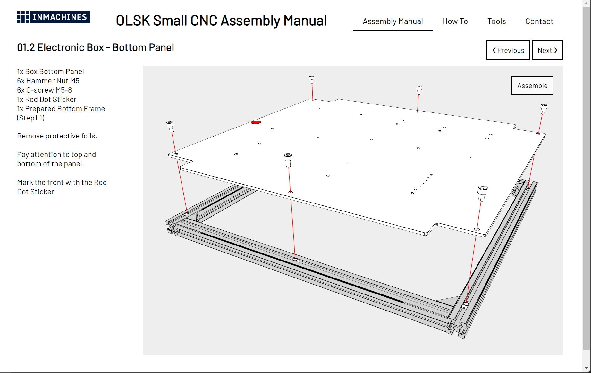

<h1 style=align="center">OLSK Online Documentation</h1>

<i>Interactive assembly manual for Open Lab Starter Kit</i>

Introduction
--

The documentation of the Open Lab Starter Kit machines is currently under development, with the goal of offering easy-to-follow instructions on how to assemble the machines. By the end of the research, each machine's documentation will be accessible online, where the user will be able to follow step-by-step instructions with an interactive 3D representation of the machine.

Pre-alpha version
--

- **[Pre-alpha version 1](Online_Documentation_vPre1)**

Installation: 
This demo can be installed using npm and runs using Vite. The following steps are needed.
- 1.Download Node.js “LTS” from **[https://nodejs.org/en/](https://nodejs.org/en/)** and install it
- 2.Open the folder in Visual Studio Code
- 3.In the terminal, type and run <b>npm run dev</b>

Notes: This developing version is only a demonstration of the concept and has many bugs and issues, to be fixed in the next versions. They include the following: 
- a slow initial load of the 3D model
- not responsive webpage
- missing conditional lines
- unfinished assembly
- missing wiring steps

Author
--

The Online Documentation has been designed and built by **[InMachines Ingrassia GmbH](https://www.inmachines.net/)**.

 

Design, programming and architecture:
- **[Liane Sayuri Honda](https://www.lianehonda.com/)**

Design and architecture:
- <b>Marc Kohlen</b> (marckohlen@3dinx.com)
  
The software is part of the **[Open Lab Starter Kit (OLSK)](https://www.inmachines.net/open-lab-starter-kit)** group of open source digital fabrication machines.

OLSK is developed by **[InMachines Ingrassia GmbH](https://www.inmachines.net/)** for the **[Dtec project](https://dtecbw.de/home/forschung/hsu/projekt-fabcity)** at **[Fab City Hamburg](https://www.fabcity.hamburg/en/)**.

OLSK Partners:
  

Contact
--

- daniele@inmachines.net
- [https://www.inmachines.net/](https://www.inmachines.net/)

License
--

Assembly manual, pictures, videos, presentations, description text and other type of media are released under the following license:

- **[GPLv3](LICENSE_CC_BY_SA_4.0.txt)**
